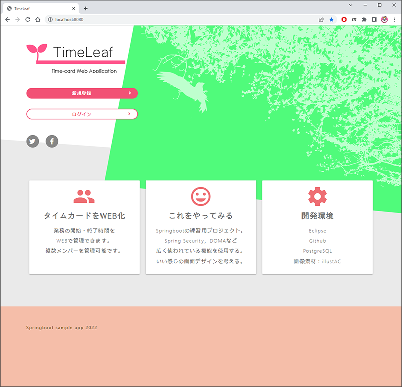

# springboot_app

## 概要

* SpringBoot練習用アプリ

* タイムカードをWEBで入力できるアプリ

## 画面サンプル

* TOP（他の画面は作成中）

## 開発環境

* JDK17

* SpringBoot

* SpringSecurity

* Doma, Doma-Gen

* Eclipse

* PostgreSQL

## 開発環境構築手順

* [こちら（Excelファイル）](readme/開発環境構築手順.xlsx "こちら（Excelファイル）")
